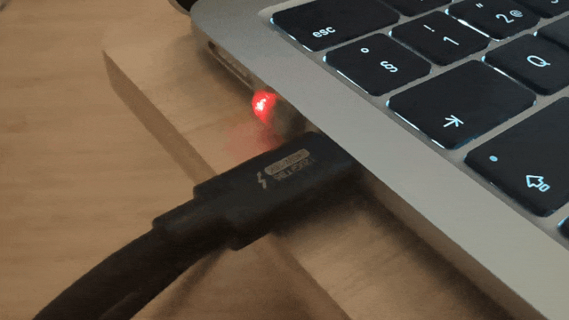
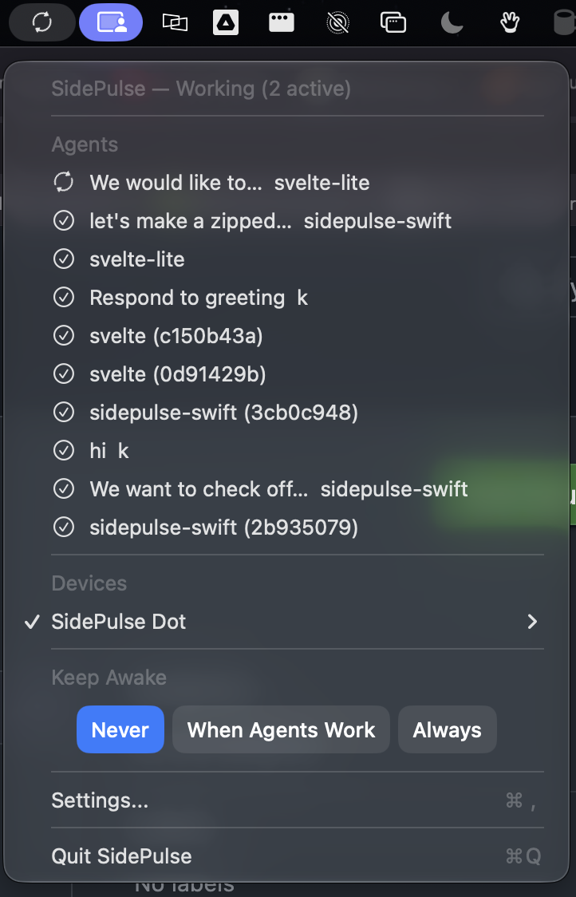
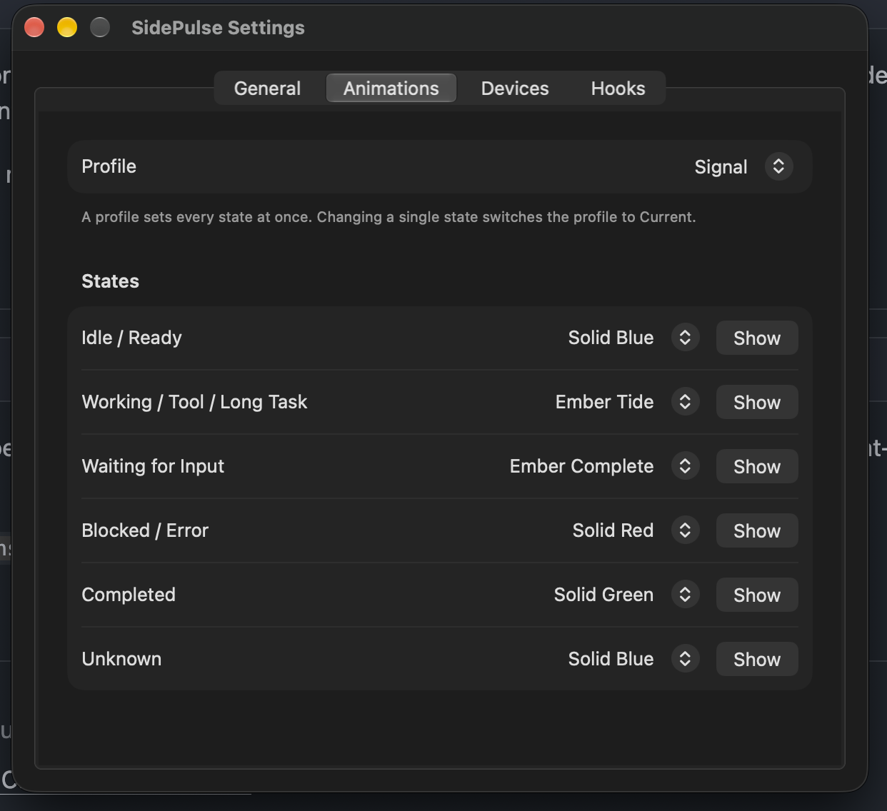

# sidepulse-swift

A lightweight replacement for the official Python [`sidepulse`](https://github.com/inteliwear/sidepulse) project.
macOS-native CLI and app with support for status notifications for Claude Code, Codex and OpenCode for SidePulse LEDs:

- **SidePulse Pro**: an 8-LED device for the MacBook Pro SD card slot.
- **SidePulse Dot**: a 2-LED USB-C device.

**[Download the latest version from the releases page](https://github.com/khromov/sidepulse-swift/releases/latest)**

<p>
  
</p>

Please uninstall the official version using `sidepulse agent-monitor uninstall all` before installing this version.

## Features

- 5.6MB app size (1.8MB zipped download), including the updater
- Updates itself from GitHub releases (see [Updates](#updates))
- Under 100MB in memory usage vs >1GB for the official implementation.

<p>
  
  
</p>

## Spec

Both mount as FAT volumes. You drive the LEDs by writing a small program to
`LEDS.LED` on the volume. The DSL is documented in the Python repo's
[`LEDS_FORMAT.md`](https://github.com/inteliwear/sidepulse/blob/main/LEDS_FORMAT.md).

### Differences from the Python version

- **Claude Code, Codex and OpenCode.** Hooks are installed into
  `~/.claude/settings.json` and `~/.codex/config.toml`, and Codex hooks are
  marked trusted automatically. OpenCode, which the Python version does not
  hook, gets a SidePulse plugin (see [How hooks work](#how-hooks-work)).
- **No Python.** It ships as one app bundle containing the menu-bar app and the
  CLI. Its only third-party dependency is [Sparkle](https://sparkle-project.org),
  which the menu-bar app uses for updates. The agent hook runs the native CLI
  directly, so no Python interpreter starts on every tool call.
- **New data paths.** Everything lives under
  `~/Library/Application Support/SidePulse`. XDG variables are never read for
  SidePulse's own files, and Python-era state in `~/.local/state/sidepulse` or
  `~/.config/sidepulse` is neither read nor removed.
- **Flat CLI.** The command is `sidepulse status`, not
  `sidepulse agent-monitor status`. Only `agent-monitor hook-log`, which
  Python-era hook commands call, is still accepted.
- **Separate LaunchAgent.** The app runs from `io.sidepulse.swift`. Uninstall
  the Python version first, because `sidepulse setup` only replaces its hooks
  and leaves its LaunchAgents running.

**Intentionally dropped:** iPhone link and push, the remote relay, the headless
service and Linux support, battery LED mode, the closed-lid
sleep helper and the Lid Open animations, status history and charts, audit and
decision-log export, the virtual SidePulse Notch device, WASM previews, the
custom animation editor and profile import/export, transcript fallback
monitoring, terminal resume/focus from session rows, `sidepulse update` (the
release app updates itself instead), and Cursor, Grok and Junie support.

## Requirements

- macOS 26 or later. The release zip is for Apple silicon only; on an Intel
  Mac, build from source with `scripts/install.sh`.
- A Swift 6 toolchain: Xcode 16 or later. The package uses swift-tools-version
  6.0 and compiles in Swift 5 language mode.
- The scripts use the standard macOS tools `codesign`, `plutil`, `ditto` and
  `launchctl`.
- The app is signed ad hoc unless you install with
  `scripts/install.sh --sign IDENTITY` (or set `SIDEPULSE_CODESIGN_IDENTITY`
  for `scripts/build-app.sh`), using a code-signing identity from
  `security find-identity -v -p codesigning`, for example
  "Developer ID Application: …" or a self-signed code-signing certificate.
  With an ad-hoc signature, macOS asks again for access to removable volumes
  (needed to write to the SidePulse device) after every update, and LED output
  waits until you answer.

## Install

From a checkout of this repository, run:

```sh
scripts/install.sh                          # build, install to ~/Applications, run setup
scripts/install.sh --no-setup               # install only; leave hooks and login item alone
scripts/install.sh --app-dir /Applications  # install somewhere else
scripts/install.sh --sign "Developer ID Application: …"   # sign with your certificate
```

`scripts/install.sh` runs these steps:

1. **Builds** `build/SidePulse.app` with `scripts/build-app.sh` (release),
   signed with `--sign` / `$SIDEPULSE_CODESIGN_IDENTITY` when given, else ad
   hoc. The bundle holds the menu-bar app at `Contents/MacOS/SidePulse` and the
   CLI at `Contents/Helpers/sidepulse`.
2. **Replaces** `DIR/SidePulse.app` (default `~/Applications`). It first
   copies the new app to `DIR/.SidePulse.app.new`, so a failed copy leaves the
   old app in place. Then it stops a running SidePulse: it boots out the
   `io.sidepulse.swift` LaunchAgent and kills any copy started by hand from
   the install location, waiting up to 10 s. Last, it swaps the new app in.
   It never replaces another app's bundle: if `DIR/SidePulse.app` has a
   bundle id other than `io.sidepulse.swift` (for example the Python app), the
   script stops before building.
3. **Links** `~/.local/bin/sidepulse` to
   `DIR/SidePulse.app/Contents/Helpers/sidepulse`. An existing symlink, such as
   the Python install's, is replaced. A regular file is moved to
   `~/.local/bin/sidepulse.previous`.
4. **Runs `sidepulse setup`**, unless you pass `--no-setup`. With `--no-setup`,
   an app that was running under launchd before is started again.

If `~/.local/bin` is not on your `PATH`, the script prints a note. After an
ad-hoc install it also prints a note about the removable-volume prompt. If
setup fails, the script still prints its notes and exits with setup's status.
To upgrade, re-run `scripts/install.sh`. The hook commands point at the stable
`~/.local/bin/sidepulse` link, so they keep working across rebuilds. This
matters for Codex, whose trust hashes bind to the exact command string.

The first time the app writes to the device after installing (and after each
ad-hoc-signed update), macOS asks "SidePulse would like to access files on a
removable volume", with the reason "SidePulse writes LED programs to your
SidePulse device." Answer the prompt. Until you do, LED output waits and the
device's submenu under **Devices** shows the waiting notice (see
[Menu-bar app](#menu-bar-app)). If you denied it, allow SidePulse under
System Settings › Privacy & Security › Files and Folders (Removable Volumes).
Installing with `--sign IDENTITY` avoids the prompt after updates.

From a release zip (see [Releasing](#releasing)), move `SidePulse.app` to
`~/Applications` or `/Applications` before you open it. macOS runs an app
opened straight from `~/Downloads` from a temporary read-only location (App
Translocation) that is gone after a restart. SidePulse then refuses to write
that location into hooks, the login item or the `sidepulse` command, and says
"SidePulse is running from a temporary location; move SidePulse.app to
Applications and reopen it." Once it runs from its final location, the app
links the `sidepulse` command into `~/.local/bin` by itself (see
**Command-line tool** under [Menu-bar app](#menu-bar-app)).
A release app keeps itself up to date (see [Updates](#updates)); an app built
with `scripts/install.sh` does not, so upgrade it by running the script again.

### What `sidepulse setup` does

```sh
sidepulse setup [claude|codex|opencode|all]... [--no-app] [--dry-run] [--no-trust]
```

1. **Installs hooks** for every agent that looks installed (`~/.claude`,
   `~/.codex`, and for OpenCode its config directory or an `opencode` binary in
   `~/.opencode/bin` or on `PATH`), or only for the providers you name. The
   same edit removes Python-era SidePulse hooks: those that call `hook_entry.py`
   or `hook-log --provider`, plus Codex `# >>> agent-monitor hooks >>>` blocks.
   It also marks the Codex hooks trusted (skip with `--no-trust`).
2. **Installs and starts the app's LaunchAgent**, so the app also starts at
   login (skip with `--no-app`). If `SidePulse.app` is not found, this step is
   skipped and setup prints instructions. If SidePulse already runs outside
   launchd, only the plist is written and the LaunchAgent takes over at the
   next login. If the LaunchAgent's own instance is running and nothing
   changed, it is left running.

`--dry-run` shows what would change without changing anything. The last line
says what was set up (without an agent config: "SidePulse is not set up yet").
Setup exits with 1 if a hook installer or launchd fails, or when nothing was
installed at all.

## Quick start

```sh
# Write an LED program. \n, \r, \t and \\ are decoded.
sidepulse write 'off\n#FF3A00 pulse\nrepeat'
sidepulse write --dry-run '#00FF66'                      # validate and print only
printf 'off\n#00FF66 pulse\nrepeat' | sidepulse write    # program from stdin
sidepulse write '#FF00FF' --device /Volumes/SidePulseDot --manual

sidepulse status        # one-shot aggregate and per-agent status
sidepulse status --watch  # redraw every 2 s, Ctrl-C to quit
sidepulse doctor        # hooks, app, socket and CLI path check
```

Programs are limited to 512 bytes and 20 lines, the controller's limits.
Without `--device`, `write` auto-discovers the SidePulse volume in `/Volumes`.
A volume counts if it contains `LEDS.LED` or its name matches SidePulse Pro,
SidePulse Dot or PulseDot. If several are mounted, pass `--device`. A
`LEDS.LED` that is a symlink, FIFO or folder is refused, even with `--device`,
so a crafted volume cannot redirect the write to another file.

The app shows agent status on every device in Agent mode, so it overwrites a
manual write at its next update. Pass `--manual` to switch that device to
Manual first. The device then stays yours until you switch it back under
**Devices** in the menu. `--manual` finds the device the way the app does and
matches it by the volume itself, so a differently cased or symlinked `--device`
path still switches the right device. A path that is not a discovered device
gets a warning, and nothing is switched. With the app running, `--manual` asks
it to reload its settings and waits up to 3 s for the reply. If the app is
still writing to that device, `write` prints a warning that the app may
overwrite the program, then writes anyway.

## CLI reference

Exit codes: `0` ok, `1` error, `2` usage error, invalid LED program, or no
device / ambiguous device. `sidepulse -V` (or `--version`) prints the version,
and `sidepulse <command> --help` shows a command's options. `run` is an alias
for `leds` without `--once`. An option that takes a value never takes the next
`--flag` as its value (`argument --file-name: expected one argument`); write
`--file-name=--x` for a value that starts with `--`.

| Command     | Purpose                                                                        |
| ----------- | ------------------------------------------------------------------------------ |
| `setup`     | Install agent hooks and start the menu-bar app                                 |
| `status`    | Show the current agent status                                                  |
| `write`     | Write an LED program to a SidePulse device                                     |
| `leds`      | Mirror agent status to the LEDs (headless)                                     |
| `run`       | Run the headless SidePulse runtime in the foreground (`leds` without `--once`) |
| `install`   | Install agent hooks (Claude Code, Codex, OpenCode)                             |
| `uninstall` | Remove agent hooks                                                             |
| `doctor`    | Check hook installation and the app                                            |
| `app`       | Start, stop or inspect the menu-bar app                                        |
| `settings`  | Open the SidePulse settings window (starts the app if needed)                  |
| `version`   | Print the version                                                              |
| `help`      | Show help for sidepulse or one command                                         |

**`sidepulse setup [claude|codex|opencode|all]... [--no-app] [--dry-run] [--no-trust]`**

- `--no-app`: only install hooks. Do not install or start the menu-bar app.
- `--dry-run`: show what would change without changing anything.
- `--no-trust`: do not mark the Codex hooks trusted.

**`sidepulse status [--json] [--all] [--offline] [--watch]`**
Asks the running app. If the app is not running, or with `--offline`, the
status is rebuilt from the hook logs with the same state machine and Codex
thread titles as the app.

- `--json`: print the snapshot as JSON.
- `--all`: also list stale agents.
- `--offline`: read the hook logs instead of asking the app.
- `--watch`: clear the screen and redraw every 2 seconds until Ctrl-C.

**`sidepulse write [PROGRAM|-] [--device PATH] [--file-name NAME] [--dry-run] [--manual]`**
`-` reads the program from stdin. Piped stdin is also read when no program
argument is given.

- `--device PATH`: device volume or its `LEDS.LED` (default: auto-discover).
- `--file-name NAME`: file to write on the volume (default `LEDS.LED`).
- `--dry-run`: validate and print the program without writing.
- `--manual`: switch the device to Manual so the app leaves it alone. The
  device is matched by its volume, not by the path as typed; a path that is not
  a discovered device prints a warning and switches nothing. A running app is
  asked to reload its settings (up to 3 s); if it is still writing to the
  device, a warning is printed and the write goes ahead.

**`sidepulse leds [--once] [--dry-run] [--device PATH] [--interval SECONDS]`**
Without `--once`, runs the SidePulse runtime in the foreground until Ctrl-C.
This is the menu-bar app without UI. It refuses to start while the app, or
another headless run, owns the socket. For a headless owner the error names its
pid: `a headless 'sidepulse run' (pid N) already drives the LEDs; stop it with
Ctrl-C in its terminal or 'kill N', or use 'sidepulse leds --once'.`

- `--once`: sync once and exit. Every connected Agent-mode device is synced.
  Exits 2 on error.
- `--device PATH`: requires `--once`. Syncs only this device, whatever its
  display mode. To limit discovery in the foreground runtime, use
  `SIDEPULSE_MOUNT_ROOTS` instead.
- `--dry-run`: compute programs but never write them.
- `--interval SECONDS`: status refresh interval in the foreground (default 15).

**`sidepulse run [--dry-run] [--interval SECONDS]`**
The same as `sidepulse leds` without `--once`.

**`sidepulse install [claude|codex|opencode|all]... [--dry-run] [--no-trust]`**
With no provider named, installs hooks for each agent that looks installed (see
`setup`). Python-era SidePulse hooks are replaced. For OpenCode, install writes
the SidePulse plugin `~/.config/opencode/plugins/sidepulse.js` and notes when
the installed OpenCode is older than 2.0, which cannot load it. Hook commands
call `~/.local/bin/sidepulse` when it links to the CLI inside a `SidePulse.app`,
else that bundled CLI directly (or the running CLI for a development build).
A `~/.local/bin/sidepulse` that is anything else, such as the Python install's,
is ignored with a note. `$SIDEPULSE_CLI_PATH` overrides all of this.

- `--dry-run`: show what would change without writing.
- `--no-trust`: do not mark the Codex hooks trusted. Install then reminds you to
  approve them with `/hooks` in Codex.

**`sidepulse uninstall [claude|codex|opencode|all]... [--dry-run]`**
Removes SidePulse hooks, current and Python-era, from every provider by
default, and deletes the SidePulse OpenCode plugin. Other hooks are left
untouched, and a `sidepulse.js` that SidePulse did not write stays with a note.

- `--dry-run`: show what would change without writing.

**`sidepulse doctor [--json]`**
For each provider, reports: config path, installed and missing events,
`hook cli` (the CLI the installed hook commands call, and whether it exists and
is the SidePulse CLI, for example
`… (missing); run 'sidepulse install claude' to repair`), and the log file. A hook CLI equal to `$SIDEPULSE_CLI_PATH` is only
checked for existence. For Codex it also reports `trust: n/m hooks trusted`,
where `m` is the number of installed SidePulse hooks, with advice to approve
them with `/hooks` or run `sidepulse install codex` when entries are missing
and the hooks feature is on. SidePulse hooks turned off with `/hooks` in Codex
(`enabled = false`) are listed as `disabled in /hooks: …; turn them back on with
/hooks in Codex`. When `~/.codex/hooks.json` also defines hooks, a `note:` says
that Codex warns about loading hooks from both files, which is harmless. When
the feature is off it reports `hooks feature: disabled ([features] turns hooks
off, so Codex runs no hooks)`, and for Claude Code under `"disableAllHooks":
true` it reports `hooks feature: disabled ("disableAllHooks": true, so Claude
Code runs no hooks)`. For OpenCode, `config` is the plugin file and `hooks` counts the
events the installed plugin emits. It reports `error:` for a `sidepulse.js`
that SidePulse did not write, for a plugin that differs from the one this
SidePulse writes (`written by another SidePulse version; run 'sidepulse install
opencode' to update it`), and when the `opencode` binary (`~/.opencode/bin` or
`PATH`) is older than 2.0. The app block reports the app binary, the LaunchAgent plist,
whether the app is running (pid and version, labelled `headless 'sidepulse run'`
for a headless owner) and the socket path. It ends with
`cli: <path> (written by install)` (or `not found`), plus a note when
`~/.local/bin/sidepulse` is not the SidePulse CLI.

- `--json`: print the report as JSON. Each provider adds `hook_cli_paths`,
  `hook_cli_problems`, `untrusted_events`, `disabled_events` and `notes`. `app` adds `cli_note`, and its
  `cli_path` may be null.

**`sidepulse app [start|stop|restart|status|install|uninstall] [--foreground]`**

| Action            | Effect                                                                                                                                                                                                                                                                                                                                                                    |
| ----------------- | ------------------------------------------------------------------------------------------------------------------------------------------------------------------------------------------------------------------------------------------------------------------------------------------------------------------------------------------------------------------------- |
| `start` (default) | Starts the app: through the LaunchAgent when its plist exists (a plist that runs another binary is started as is, with a note to run `sidepulse app install`), otherwise opens `SidePulse.app` for this session only, without turning on launch at login. A running app is left alone ("already running (pid N)"). Fails while a headless `sidepulse run` owns the socket |
| `stop`            | Boots the app out. The plist stays, so the app returns at next login ("kept" is printed only when the plist exists). When the socket owner is not the LaunchAgent's instance, it changes nothing and fails: an app running outside launchd must be quit from the menu bar, and a headless `sidepulse run` must be stopped with Ctrl-C or `kill`                           |
| `restart`         | `launchctl kickstart -k` of the LaunchAgent's instance. Fails when the app runs outside launchd or a headless `sidepulse run` owns the socket                                                                                                                                                                                                                             |
| `status`          | Shows plist, launchd and socket state. Exits 0 only when the app answers; a headless `sidepulse run` shows as `app: not running (a headless 'sidepulse run' (pid N) owns the socket)`                                                                                                                                                                                     |
| `install`         | Writes the LaunchAgent and starts it. If SidePulse already runs outside launchd, or a headless `sidepulse run` owns the socket, only writes the plist                                                                                                                                                                                                                     |
| `uninstall`       | Boots the LaunchAgent out and deletes the plist                                                                                                                                                                                                                                                                                                                           |

- `--foreground`: only with `start`. Runs the app in this terminal instead of
  via launchd. Refuses while the app or a headless `sidepulse run` owns the
  socket.

**`sidepulse settings`** asks the running app to open its Settings window, and
starts the app if needed: through its LaunchAgent when launch at login is on,
otherwise for this session only. It never changes the login item. If a headless
`sidepulse run` or `sidepulse leds` owns the socket, it says so instead.

**`sidepulse version`** and **`sidepulse help [COMMAND]`** print the version
and the help text.

`sidepulse hook-log --provider <claude|codex|opencode>` is the internal entry
point that agent hooks and the OpenCode plugin call. See
[How hooks work](#how-hooks-work).

## Agent status

Every hook event maps to a mode. The mode decides the menu-bar icon and the LED
animation.

| Mode               | Priority | Menu bar | Default LED (Signal profile) | Set by                                                                                                                                        |
| ------------------ | -------- | -------- | ---------------------------- | --------------------------------------------------------------------------------------------------------------------------------------------- |
| Blocked / Error    | 1        | Ask      | `red-double-blink`           | `PostToolUseFailure`, `PermissionDenied`, `StopFailure`, `PostToolUse` with a failed tool response                                            |
| Waiting for Input  | 2        | Ask      | `solid-red`                  | `PermissionRequest`, a `permission_prompt`, `elicitation_dialog`, `elicitation_url_dialog`, `agent_needs_input` or `idle_prompt` Notification |
| Tool Running       | 3        | Working  | `ember-tide`                 | `PreToolUse`                                                                                                                                  |
| Long Task Progress | 4        | Working  | `ember-tide`                 | Not produced by any event today                                                                                                               |
| Working            | 5        | Working  | `ember-tide`                 | `UserPromptSubmit`, `PreCompact`, `PostCompact`, `SubagentStart`, a successful `PostToolUse`                                                  |
| Completed          | 6        | Done     | `solid-green`                | `Stop`/`SubagentStop`, `SessionEnd`, a subagent closed along with its session or its parent's turn (see Subagents below)                      |
| Idle / Ready       | 7        | Idle     | `solid-blue`                 | `SessionStart`, `Interrupt` (Codex, OpenCode)                                                                                                 |

How the global display state is chosen:

- **Aggregation.** The display shows the highest-priority mode (lowest number)
  across all fresh agents. If any agent is blocked or waiting, the LEDs show
  that, not every agent separately. With no fresh agent, the display is Idle.
- **Staleness.** A row goes stale once it is older than the **Idle timeout**
  (default 1 hour, set in Settings > General). Stale rows drop out of the
  aggregate. `status --all` still lists them. Tool Running has
  no separate time limit. A row dated more than 5 minutes in the future (after
  the clock was set back) is stale too.
- **Done window.** A Completed row stays visible for 20 minutes, then drops
  out, and the LEDs return to the dim idle pattern. Completed and Idle rows are
  set aside while any other agent is active, so Done only shows when nothing
  else is running. Idle rows are hidden right away.
- **Idle prompts.** A Completed row ignores every Notification. Claude's
  `idle_prompt` Notification ("Claude is waiting for your input") is also
  ignored while the row is Idle, and for a session with no row yet (for
  example when the startup log scan begins after that session's `Stop`). So it
  never turns Done, a fresh session nobody has typed into, or a session whose
  history was not seen, into Ask. Other Notifications, such as permission
  prompts, still ask on a row that is not Completed.
- **Other Notifications.** A Notification type not named in the table, such as
  `auth_success` or `agent_completed`, is ignored, and so is a Notification
  without a type, so it never starts a Working row that nothing settles.
- **Settling.** `PostToolUse` means the tool returned, not that the turn has
  finished. If no newer event arrives, the Working row settles to Completed
  after 2 minutes. This way a missed `Stop` cannot leave the display stuck on
  Working.
- **Sticky permissions.** A `PermissionRequest` for a command stays Ask until
  the matching `PostToolUse` or `PostToolUseFailure` (the approved command
  finished or failed), `Stop`, `Interrupt`, `SessionEnd`, the subagent's own
  `SubagentStop`, or the next prompt. Unrelated events from the same session
  cannot hide it. A denied command runs nothing, so it stays Ask until the turn
  ends or the next prompt. A prompt still pending when the app restarts stays
  sticky, because the startup log scan rebuilds it.
- **Subagents.** Claude sends no `SubagentStop` for a subagent killed with its
  session, so `SessionEnd` closes the session's active subagent rows instead of
  leaving them active (and holding keep-awake) until the idle timeout. A parent
  `Stop` lists the background tasks still running, and a subagent that was on
  the previous `Stop`'s list but is missing from this one is closed too. The
  list also holds workflow and shell task ids, so a subagent that was never
  listed, such as one a Workflow runs, stays open until its own `SubagentStop`
  or the idle timeout. OpenCode subagents run synchronously, so the parent's
  `Stop`, `StopFailure` or `Interrupt` closes any that are still open.
- **Interrupt.** `Interrupt` (Codex, and OpenCode for a stopped or cancelled
  turn) returns the session to Idle without marking it Completed.

### Message text

SidePulse never reads what an agent writes to choose a state. A turn that ends
is Done, and Ask comes only from the agents' own signals: permission prompts,
question tools (Claude Code's `AskUserQuestion`, OpenCode's question tool) and
the input Notifications in the table above. A question an agent asks in plain
text at the end of its turn therefore shows as Done. Nothing needs to go into
your projects' `CLAUDE.md` or `AGENTS.md`.

## Menu-bar app

`SidePulse.app` is a menu-bar-only app with no Dock icon. The icon is an SF
Symbol for the aggregate state: Idle, Working, Done or Ask. Working rotates and
Ask pulses at 8 frames per second. The animation stops while the displays
sleep, while another user's session is in front, and when Reduce Motion is on.
The tooltip reads `SidePulse Agent Monitor: <state>`. If you open the app again
while it is running, for example from Finder, it shows Settings. A second copy
asks the running one to show Settings and exits. Only when the socket belongs
to a headless `sidepulse run` or `sidepulse leds` does it show an alert. A copy
started by the LaunchAgent exits quietly (see `app.log`).

| Menu item                        | What it does                                                                                                                                                                                                                                                                                                                                                                                                                                       |
| -------------------------------- | -------------------------------------------------------------------------------------------------------------------------------------------------------------------------------------------------------------------------------------------------------------------------------------------------------------------------------------------------------------------------------------------------------------------------------------------------- |
| `SidePulse — Working (2 active)` | Header: aggregate state and number of active agents                                                                                                                                                                                                                                                                                                                                                                                                |
| **Agents**                       | Up to 10 recent sessions (subagents fold into their session), by priority then recency. Includes Completed sessions from the last 48 hours by default. Titles longer than 22 characters (project names over 16) are shortened with "…" so the menu stays narrow. The tooltip shows the full title when shortened, then state, event, tool, age and origin (for example "Claude Code CLI"). Click a session to open its working directory in Finder |
| **Devices**                      | One submenu per connected or remembered device: **Agent Status** / **Manual**, a **Brightness** slider, the last write error or permission notice (see **Permission** below), and **Remove** for devices that are not connected                                                                                                                                                                                                                    |
| **Keep Awake**                   | One centered row of three buttons: **Never** / **When Agents Work** / **Always**, with the active one in the accent color. "Keeping Mac awake" appears below while the Mac is held awake                                                                                                                                                                                                                                                           |
| **Update Available: X.Y.Z...**   | Below the header when a daily check found an update while SidePulse was in the background. Opens the update window (see [Updates](#updates))                                                                                                                                                                                                                                                                                                      |
| **Settings...** (⌘,)             | Opens the settings window                                                                                                                                                                                                                                                                                                                                                                                                                          |
| **Check for Updates...**         | Checks for a new release now, or brings up the update in progress. Release builds only                                                                                                                                                                                                                                                                                                                                                             |
| **Quit SidePulse** (⌘Q)          | Quits the app                                                                                                                                                                                                                                                                                                                                                                                                                                      |

The Settings window has four tabs:

| Tab        | Contents                                                                                                                                                                                                                                                                                                                                                                                                                                                                                                                                                                                                                                                                                                                                                                                                           |
| ---------- | ------------------------------------------------------------------------------------------------------------------------------------------------------------------------------------------------------------------------------------------------------------------------------------------------------------------------------------------------------------------------------------------------------------------------------------------------------------------------------------------------------------------------------------------------------------------------------------------------------------------------------------------------------------------------------------------------------------------------------------------------------------------------------------------------------------------ |
| General    | **Idle timeout** (15 min to 4 hours, default 1 hour). **Keep recent sessions for** (12 hours to 7 days, default 48 hours). The Keep Awake policy. **Let Mac sleep on battery below** (0 to 100 % in steps of 5, default 20 %, 0 = off). **Turn off LEDs whenever the Mac sleeps** (off by default; see Sleep below). **SidePulse Pro Eject Prevention** (on by default; see Eject prevention below). **Launch at Login** (adds or removes the LaunchAgent plist). **Open Logs Folder** (reveals `logs/` in Finder). **Command-line tool**: whether `~/.local/bin/sidepulse` runs this app, **Install**, and a check that your shell finds it, with **Add to PATH** when it does not (see Command-line tool below). **Updates**: **Check for updates automatically**, **Download and install updates automatically**, the version and **Check Now** (a build from source shows only its version) |
| Animations | Profile picker: **Signal** (the default: solid blue idle, ember roll while working, solid red when waiting, a red double blink on error, a blue double blink when unknown, solid green when done), **Cyan**, **Ember** or **Purple**. It shows **Current** when your picks match no profile. Per-state pickers for Idle / Ready, Working / Tool / Long Task (shared), Waiting for Input, Blocked / Error, Completed and Unknown. **Mac goes to sleep**, the animation that turns the LEDs off as the Mac sleeps (see Sleep below). **Show** plays a pick on connected Agent-mode devices for 3 seconds, then restores live status                                                                                                                                                                                                                                                                                    |
| Devices    | For each device: connection state, LED count, path, a **Display** switch (Agent Status / Manual), a **Brightness** slider, the last error or permission notice, and **Remove** when not connected                                                                                                                                                                                                                                                                                                                                                                                                                                                                                                                                                                                                                  |
| Hooks      | For each provider: status (Installed; Needs repair when the hooks call a missing or non-SidePulse CLI; Installed, not trusted when Codex has no trust entry, so approve with `/hooks` in Codex or reinstall; Installed, but <Provider> hooks are disabled, for Codex's `[features]` switch or Claude Code's `disableAllHooks`; Installed, but turned off with /hooks in Codex; Partial; Not installed; Not detected; Error), config path, the CLI its hooks call (**Hooks call**), and **Install** / **Uninstall**. **Install writes** shows the command new hooks get, with **Refresh**                                                                                                                                                                                                                           |

The built-in animations are Slow Off, Immediate Off, Fade Off, Idle Pulse, Cyan
Roll, Cyan Complete, Amber Pulse, Solid Green, Solid Red, Solid Blue, Red Double
Blink, Blue Double Blink, KITT Scanner, KITT Scanner Red, Night Rider, Lid Closed
Sweep, and the Ember and Purple families (Idle, Tide, Attention, Complete).
Animations that depend on the LED layout have separate 2-LED and 8-LED
variants.

- **Devices.** The app polls `/Volumes` every 2 seconds, so devices can be
  plugged in and out at any time. Only local FAT (`msdos`) and exFAT volumes
  count: other mounts under `/Volumes`, such as network shares and disk
  images, are skipped without being accessed. A `LEDS.LED` or `keepalive` that
  is not a regular file (a symlink, FIFO or folder) is never written. Dot and
  PulseDot volume names get the 2-LED programs, and everything else gets the
  8-LED ones. The app touches
  `keepalive` on each connected 8-LED volume (SidePulse Pro, including Manual
  ones) at most once a minute, which stops the MacBook SD reader from powering
  it off. Dots (USB) are never touched. A device that has
  never been seen before starts in Agent mode.
- **Manual mode.** In Manual mode, SidePulse never writes `LEDS.LED` on that
  device (a Pro still gets keepalive touches). Switching a connected device to
  Manual writes `off` once, but only while `LEDS.LED` still holds the program
  SidePulse last wrote there: a program written in the meantime is kept, and a
  device SidePulse has not written to since it started is left as it is. If
  that `off` fails, the error stays on the device until it is synced in Agent
  mode again. `sidepulse write --manual` switches a device to Manual from the
  CLI.
- **Permission.** A device whose write or keepalive touch has been stuck for
  over 2 s, normally on the macOS removable-volume prompt, shows
  `Error: Waiting for macOS permission to access this device — check for a
system prompt`. If macOS refuses to open `LEDS.LED` (`Operation not
permitted`), it shows `Error: macOS denied access. Allow SidePulse in System
Settings › Privacy & Security › Files and Folders (Removable Volumes)`, and
  the original error goes to `app.log`. A read-only `LEDS.LED` shows `Could not
open <path>: Permission denied` instead, and a Finder-locked one `<path> is
locked`. The Settings window's Devices tab shows the same text. A write that
  was waiting is skipped if the device became Manual in the meantime.
- **Brightness.** Each device has its own brightness, 0 to 255 (shown as a
  percentage). Below full brightness it adds a `brightness N` line in front of
  the animation; the built-in animations never set their own.
- **Keep awake.** The app holds a macOS power assertion
  (PreventUserIdleSystemSleep, listed by `pmset -g assertions` as "SidePulse
  keep awake"). The Mac does not idle-sleep, but the display may still sleep.
  The assertion goes away when the app quits. It is held while the policy asks
  for it:
  - **Always**: while the app runs.
  - **When Agents Work**: while any agent is Working, Tool Running or Long Task
    Progress, even if another one waits or is blocked, plus 5 minutes after a
    Completed, Ask or Blocked state.
  - **Never**: off.
  - **Low-battery safeguard**: on battery below the threshold (default 20 %),
    the Mac is always allowed to sleep.
- **Sleep.** A device keeps playing its program for as long as it has power,
  and USB stays powered while the Mac sleeps. So when the Mac goes to sleep
  with the lid closed, SidePulse plays the **Mac goes to sleep** animation on
  every Agent Status device, at the device's brightness, and only then lets
  macOS sleep. Pick it in Settings > Animations > Sleep: Fade Off (the default,
  `off 320ms cosine`), Lid Closed Sweep (from the Python version), Slow Off or
  Immediate Off. Only animations that end dark are offered, and profiles leave
  the pick alone. The LEDs stay off, including through Power Nap wakes, until
  the Mac wakes and is in use again, with the lid open or closed on an external
  display. Then they show the live status again. Closing the lid on an external display doesn't sleep the Mac,
  so the LEDs stay on. **Turn off LEDs whenever the Mac sleeps** (Settings >
  General, off by default) also turns them off when the Mac sleeps with the
  lid open, or a Mac without a lid sleeps. Manual devices are left alone.
  `app.log` records each sleep and wake (`sleep: Mac sleeping (lid closed), LEDs
  off`, `sleep: Mac in use again, LEDs back on`). This works in the app and in
  a headless `sidepulse run`.
- **Eject prevention.** After a wake from hibernation, the built-in SD reader
  reconnects its card. If the screen is locked at that moment, macOS refuses
  the mount and ejects the card, so a SidePulse Pro goes dark. SidePulse Pro
  Eject Prevention (Settings > General, on by default) stops that, as the
  Python version's helper does: the app asks DiskArbitration to approve every
  eject, refuses the eject of any card whose device protocol is "Secure
  Digital" or whose model contains "SDXC", and retries the mount every 5
  seconds until it succeeds, which is after you unlock. Each refusal is logged
  in `app.log` (`sd-eject-guard: prevented eject of disk4 (volume: …)`). While
  it is on, no card in the built-in reader can be ejected, from Finder or with
  `diskutil` ("SidePulse Pro Eject Prevention: keeping SD card attached"), and
  an unmounted one is mounted again, so turn it off before you eject a card.
  It runs in the menu-bar app only, not in a headless `sidepulse run`, and the
  Dot (USB-C) never needs it.
- **Launch at login.** This is the LaunchAgent
  `~/Library/LaunchAgents/io.sidepulse.swift.plist`, with `RunAtLoad` and
  `KeepAlive = {SuccessfulExit: false}`. It also sets `PATH` so the app finds
  `codex` and `node`: the `PATH` of the process that writes the plist (your
  shell for `sidepulse app install`, `sidepulse setup` and
  `scripts/install.sh`, the app's own minimal `PATH` when the Settings toggle
  writes it) plus `~/.local/bin`, `/opt/homebrew/bin` and `/usr/local/bin`.
  launchd restarts the app after a crash, but it stays quit after **Quit**. Only `sidepulse app install`,
  `sidepulse setup` and the Settings toggle write the plist. Turning the toggle on
  writes the plist for the running binary without starting a second copy. It
  refuses while the app runs from a temporary App Translocation location (see
  [Install](#install)).
  `sidepulse app uninstall` removes the plist.
- **Command-line tool.** Each time it starts, the app points
  `~/.local/bin/sidepulse` at its own `Contents/Helpers/sidepulse`, the same
  link `scripts/install.sh` makes. It creates a missing link and replaces a
  dangling one or one into another `SidePulse.app` (an older copy or a build
  from source), so the command and the hooks that call the link always match
  the running app. Each change is logged in `app.log` (`app: linked … -> …`).
  Anything else at that path, such as the Python CLI's link or a plain file, is
  left alone: Settings › General › Command Line then shows it with an
  **Install** button, which replaces a symlink and moves a file to
  `~/.local/bin/sidepulse.previous`. An app built with SwiftPM or running from
  a translocated location never links. Once the link is in place, Settings runs
  your login shell (`$SHELL -i -l`, the way Terminal starts it, up to 5 s) to
  read its `PATH`, and says whether the shell finds the command, finds another
  `sidepulse` first, or does not have `~/.local/bin` on `PATH`. In the last
  case, for zsh and bash, **Add to PATH** appends
  `export PATH="$HOME/.local/bin:$PATH"` to `~/.zprofile` (bash: the first of
  `~/.bash_profile`, `~/.bash_login` and `~/.profile` that exists), with a
  backup of the old file. New terminal windows then find `sidepulse`.

### Updates

Release builds update themselves with [Sparkle](https://sparkle-project.org)
from this repository's GitHub releases. Once a day, and at launch when the last
check is older than that, the app reads `appcast.xml` from the latest release
(`https://github.com/khromov/sidepulse-swift/releases/latest/download/appcast.xml`).
It does not ask for permission first. The feed lists the new version for Apple silicon and
macOS 26 or later, so an older Mac is never offered an update it cannot run.

- **When there is a new version**, Sparkle's window shows its release notes with
  **Install Update**, **Skip This Version** and **Remind Me Later**. If the check
  runs at launch, the window opens right away. Otherwise SidePulse does not pop
  a window in the background: the menu shows **Update Available: X.Y.Z...**
  below the header until you open it or the update is dismissed.
- **Installing** downloads the release zip, checks its EdDSA signature against
  the public key in the running app's `Info.plist` and checks the new app's code
  signature. Then it quits SidePulse, replaces `SidePulse.app` in place and
  opens the new version. An app in `/Applications` that your user cannot write
  asks for an administrator password. Everything that points into the bundle
  keeps working: the `~/.local/bin/sidepulse` link, the hooks and the
  LaunchAgent. The removable-volume permission also survives, because it
  belongs to the Developer ID signature. The new version is opened like a
  manual launch, so launchd restarts it after a crash again only from the next
  login.
- **Download and install updates automatically** (off by default; the update
  window has the same checkbox) downloads new versions in the background and
  installs them the next time SidePulse quits. After a week without a quit, the
  update window comes up.
- **Builds from source** (`scripts/install.sh`, `scripts/build-app.sh`) have no
  feed URL, so they never check and never replace themselves with a release
  build. The menu has no **Check for Updates...** item, and Settings shows only
  the version.

Sparkle logs to Console.app. SidePulse writes `app: installing update X.Y.Z`
and failed checks (`app: update failed: …`) to `app.log`.

## Files & paths

| Path                                                                       | Contents                                                                                                                                                                                                                                                                                                                                                                     |
| -------------------------------------------------------------------------- | ---------------------------------------------------------------------------------------------------------------------------------------------------------------------------------------------------------------------------------------------------------------------------------------------------------------------------------------------------------------------------- |
| `~/Library/Application Support/SidePulse/settings.json`                    | Settings: devices, animations, timeouts, keep-awake, eject prevention. Hand edits are picked up at the next refresh. An unreadable file is backed up before it is replaced                                                                                                                                                                                                   |
| `…/SidePulse/latest.json`                                                  | Restart snapshot of agent rows, written with a short delay                                                                                                                                                                                                                                                                                                                   |
| `…/SidePulse/logs/claude.jsonl`, `logs/codex.jsonl`, `logs/opencode.jsonl` | Trimmed hook records, mode 0600. Rotated to `.1` at 8 MB                                                                                                                                                                                                                                                                                                                     |
| `…/SidePulse/events.sock`, `events.sock.lock`                              | Unix socket served by the app, and the lock the serving instance holds. If the path is too long, the socket falls back to `/tmp/sidepulse-<uid>/events-<hash>.sock`, one per data root. That directory must be a real directory owned by you with mode 0700                                                                                                                  |
| `…/SidePulse/app.log`, `app.out.log`, `app.err.log`                        | App diagnostics, and the LaunchAgent's stdout and stderr                                                                                                                                                                                                                                                                                                                     |
| `~/Library/LaunchAgents/io.sidepulse.swift.plist`                          | Launch at login                                                                                                                                                                                                                                                                                                                                                              |
| `~/Library/Preferences/io.sidepulse.swift.plist`                           | Sparkle's update settings and state: automatic checks and downloads, last check time, a skipped version (`defaults read io.sidepulse.swift`)                                                                                                                                                                                                                              |
| `~/Library/Caches/io.sidepulse.swift/`                                     | Update downloads, kept only until the update is installed                                                                                                                                                                                                                                                                                                                  |
| `~/Applications/SidePulse.app`                                             | The app (`--app-dir` changes the location). `sidepulse` also finds it in `/Applications`                                                                                                                                                                                                                                                                                     |
| `~/.local/bin/sidepulse`                                                   | Symlink to `SidePulse.app/Contents/Helpers/sidepulse`, kept pointed at the running app at each launch (and made by `scripts/install.sh`). This is the path written into hook commands when it links into a `SidePulse.app`; otherwise hooks call the bundled CLI directly                                                                                                    |
| `~/.claude/settings.json`, `~/.codex/config.toml`                          | Agent configs. `$CLAUDE_CONFIG_DIR` and `$CODEX_HOME` are honored. Every change backs up the old file as `<file>.bak.<stamp>`, and the newest 3 are kept. A symlinked config (dotfiles) keeps its link, and the real file behind it is updated. A read-only config is never rewritten: install and uninstall fail with `<path> is read-only; make it writable and try again` |
| `~/.config/opencode/plugins/sidepulse.js`                                  | The SidePulse OpenCode plugin, in OpenCode's global config directory (`$OPENCODE_CONFIG_DIR`, else `$XDG_CONFIG_HOME/opencode`, as OpenCode resolves it). Install rewrites it and backs up a changed older copy as `sidepulse.js.bak.<stamp>`, which OpenCode does not load. Uninstall deletes it. A file without SidePulse's marker line is never replaced or deleted       |
| `/Volumes/<device>/LEDS.LED`, `/Volumes/<device>/keepalive`                | Device files (`keepalive` on 8-LED devices only)                                                                                                                                                                                                                                                                                                                             |

Environment overrides:

| Variable                                 | Effect                                                                                                                                                                          |
| ---------------------------------------- | ------------------------------------------------------------------------------------------------------------------------------------------------------------------------------- |
| `SIDEPULSE_HOME`                         | Replaces the data root (`~/Library/Application Support/SidePulse`). A relative path is relative to `HOME`, not to the working directory                                         |
| `SIDEPULSE_MOUNT_ROOTS`                  | Colon-separated directories to scan for devices, instead of `/Volumes`                                                                                                          |
| `SIDEPULSE_CLI_PATH`                     | CLI path to write into hook commands, taken as is (doctor only checks that it exists)                                                                                           |
| `SIDEPULSE_APP_PATH`                     | App bundle or binary used by `app`, `setup`, `settings` and `doctor`                                                                                                            |
| `SIDEPULSE_DISABLE_EVENT_SOCKET=1`       | The hook only logs and does not notify the app                                                                                                                                  |
| `SIDEPULSE_AGENT_ORIGIN`                 | Override the detected origin label, for example "Claude in VS Code"                                                                                                             |
| `CLAUDE_CONFIG_DIR`                      | Claude Code config directory, where the hooks go (`settings.json`)                                                                                                              |
| `CODEX_HOME`, `CODEX_CLI_PATH`           | Codex config directory, and the `codex` binary used for hook trust                                                                                                              |
| `OPENCODE_CONFIG_DIR`, `XDG_CONFIG_HOME` | OpenCode's global config directory, where the plugin goes (the same lookup OpenCode uses)                                                                                       |
| `SIDEPULSE_CODESIGN_IDENTITY`            | Code-signing identity for `scripts/build-app.sh`, `scripts/install.sh` and `scripts/release.sh` (default: ad hoc; for `release.sh`, the only Developer ID Application identity) |
| `SIDEPULSE_NOTARY_PROFILE`               | notarytool keychain profile for `scripts/release.sh` (default: `notary`)                                                                                                        |

The app started by the LaunchAgent does not see variables exported in your
shell, except `PATH`, which is copied into the plist from the process that
writes it (see Launch at login under [Menu-bar app](#menu-bar-app)).

## How hooks work

`sidepulse install` (or `setup`) writes one command per provider:

```text
/Users/you/.local/bin/sidepulse hook-log --provider claude ; true
```

The trailing `; true` makes a hook fail open: whatever happens, the agent sees
success. Each handler also gets a 10 s timeout.

- **Claude Code.** For each of `SessionStart`, `UserPromptSubmit`,
  `PreToolUse`, `PostToolUse`, `PostToolUseFailure`, `PermissionRequest`,
  `Notification`, `PreCompact`, `PostCompact`, `SubagentStop`, `Stop` and
  `SessionEnd`, the installer adds this entry to `hooks.<Event>`:
  `{"matcher": "*", "hooks": [{"type": "command", "command": "…", "timeout": 10}]}`.
  The rest of the file is preserved, and it is not rewritten when nothing
  changes. A `"disableAllHooks": true` is left alone; install notes it, and
  doctor and Settings report the hooks as disabled.
- **Codex.** The installer writes one managed block between
  `# >>> sidepulse hooks >>>` and `# <<< sidepulse hooks <<<`. The block has
  one `[[hooks.<Event>]]` group each for `SessionStart`, `UserPromptSubmit`,
  `PreToolUse`, `PostToolUse`, `PermissionRequest`, `PreCompact`,
  `PostCompact`, `SubagentStart`, `SubagentStop`, `Stop` and `Interrupt`. The
  installer does not touch `[features]`, because Codex enables hooks by
  default. An explicit `hooks = false` (or the deprecated `codex_hooks = false`
  without `hooks`) is left alone; install notes it, doctor reports the hooks
  feature as disabled, and Codex runs no hooks until you turn them back on.
  TOML puts a key written after a table header into that table, so a key you
  append below the block lands in SidePulse's last table (a hook or its trust
  entry), where Codex ignores it. Install and uninstall would remove it with
  that table, so they refuse to edit the file, with `TOML puts <key> in
SidePulse's <table> table; move it above the SidePulse block; fix it by
hand, then retry`. They do the same for any other key SidePulse did not write
  in its own groups or trust tables. When `~/.codex/hooks.json` also defines hooks,
  install notes that Codex warns about loading hooks from both files, which is
  harmless.
- **Codex trust.** After writing the block, the installer finds `codex` in
  `$CODEX_CLI_PATH`, `ChatGPT.app` or `Codex.app`, `PATH`, then
  `~/.local/bin`, `/opt/homebrew/bin`, `/usr/local/bin`, `~/.bun/bin`,
  `~/.npm-global/bin`, `~/.volta/bin` and the newest
  `~/.nvm/versions/node/*/bin`. It asks `codex app-server --stdio` for the
  current hook hashes (`hooks/list`) and writes a
  `[hooks.state."<key>"] trusted_hash = "…"` table for each SidePulse hook.
  Trust entries for your own hooks, including groups that list their handlers
  inline (`hooks = [...]`), are kept in step when their positions shift.
  If Codex is not found, or you pass `--no-trust`, approve the hooks with
  `/hooks` in Codex. With `hooks = false`, trust is skipped. Doctor and
  Settings report hooks without trust entries. A SidePulse hook you turned off
  with `/hooks` (`enabled = false`) stays off, even when its command changes:
  install still writes its hash, leaves it out of the `trusted N Codex hooks`
  count and notes `disabled in /hooks: …`. Doctor and Settings report it too.
- **OpenCode.** OpenCode has no hook settings, so the installer writes a
  plugin that calls the same command. See
  [The OpenCode plugin](#the-opencode-plugin).
- **Identification.** SidePulse finds its own hooks, current and Python-era,
  by command markers such as `hook-log --provider`. It never goes by log
  paths, so your other hooks are never touched. The OpenCode plugin is ours
  only when it has the marker line `// sidepulse hook-log --provider opencode`.

On every event, `sidepulse hook-log`:

1. Reads the JSON payload from stdin, up to 16 MiB and 3 s (nothing when stdin
   is a terminal).
2. Builds a **trimmed record**. The record keeps:
   - the event name, session and agent ids, cwd and tool name (snake_case
     keys only);
   - `tool_input.command` (up to 2000 characters);
   - the `interrupted`, `success` and `exit_code` fields of the tool response,
     plus a `tool_response_failed` flag;
   - `prompt` (up to 4000 characters);
   - `last_assistant_message` (up to 2000 characters), kept only as the row's
     message;
   - `message`, `notification_type` and `error_details`;
   - `background_task_ids`: the ids of the tasks Claude lists as still running
     on `Stop`/`SubagentStop` (up to 32 ids of up to 128 characters; omitted
     when the list does not fit);
   - the detected origin.

   Invalid JSON, including JSON nested more than 128 levels deep, becomes a
   `ParseError` record. A payload without an event name, such as a hand-run
   command with no input, is dropped here.

3. Appends the record as one line to `logs/<provider>.jsonl`. If an
   interrupted write left the last line unfinished, the record starts on a
   new line. The append never waits: a log path that is not a regular file
   (a FIFO, say) is skipped, and when another process holds the log's lock
   the 8 MB rotation is left to a later hook.
4. Sends `{"provider": …, "line": {…}}` to `events.sock` with a 0.2 s timeout,
   and only when both the socket file and the process serving it belong to
   the current user.

Each step is independent, so a dead socket never loses the log line. The hook
never writes to stdout and always exits 0. Python-era hook commands of the form
`sidepulse agent-monitor hook-log …` are still accepted.

### The OpenCode plugin

OpenCode 2 loads every `.js` file in the `plugins/` folder of its config
directory, so `sidepulse install opencode` writes
`~/.config/opencode/plugins/sidepulse.js`. A running OpenCode loads or unloads
the file within a few seconds, without a restart. The file starts with a
`// Managed by SidePulse` comment and the marker line, and holds the hook CLI
path as `const CLI = "…"`.

The plugin has no dependencies. It reads OpenCode's event stream, which is
buffered, and queues records rather than waiting for the CLI, so a slow hook
never delays OpenCode. It never throws or writes to stdout. For each event
below it runs `<cli> hook-log --provider opencode` with a Claude-shaped record
on stdin. It runs one CLI at a time, so the records keep their order: a CLI
still running after 2 s is killed, with its process group, before the next one
starts. At most 200 records wait. Beyond that the oldest waiting `PreToolUse`
or `PostToolUse` record is dropped, and only when none is waiting the oldest
record. When the event stream ends or fails, the plugin subscribes again after
a pause that starts at 0.5 s and doubles up to 30 s; events sent in that gap
are lost.

| OpenCode event                                                          | Record                                                                                                                         |
| ----------------------------------------------------------------------- | ------------------------------------------------------------------------------------------------------------------------------ |
| `session.created`                                                       | `SessionStart`                                                                                                                 |
| `session.execution.started`                                             | `UserPromptSubmit`, with the prompt from `session.inbox.enqueued`. A prompt sent while the session is busy is reported at once |
| `session.tool.called`                                                   | `PreToolUse`, with the tool name and, for `shell`, the command                                                                 |
| `session.tool.success`                                                  | `PostToolUse`, with the shell exit code. A non-zero exit shows Blocked / Error                                                 |
| `session.tool.failed` (declined permission, Ctrl-C, dismissed question) | `PostToolUseFailure`                                                                                                           |
| `permission.asked`, `form.created` (the question tool)                  | `PermissionRequest`                                                                                                            |
| `session.compaction.started`, `session.compaction.ended`                | `PreCompact`, `PostCompact`                                                                                                    |
| `session.execution.succeeded`                                           | `Stop`, with the text of the turn's last assistant message as the row's message                                                |
| `session.execution.failed`                                              | `StopFailure`, with the error type and message                                                                                 |
| `session.execution.interrupted`                                         | `Interrupt`                                                                                                                    |
| `session.deleted`                                                       | `SessionEnd`, only for a session the plugin has seen since OpenCode started, so deleting old sessions adds no rows             |

- **Subagents.** A subagent session reports under its parent session with its
  own `agent_id` (`SubagentStart`, `SubagentStop`), like a Claude subagent.
  OpenCode reports no end for a subagent that failed or still waits on a
  prompt, so the parent's `Stop`, `StopFailure` or `Interrupt` closes the
  subagent rows that are still open. Rows show the last 8
  characters of the `ses_…` id, because the start of the id changes slowly.
- **One copy per project.** OpenCode's background service loads the plugin
  once per open project, and every copy sees every event. The copies share
  their state, so each event is handled once.
- **Origin.** Records carry `agent_origin: "OpenCode"`, so no origin detection
  runs.
- **Environment.** The plugin runs inside OpenCode's background service and
  inherits its environment, so variables such as `SIDEPULSE_HOME` come from
  whatever first started the service.
- **Version.** It needs OpenCode 2.0 or later. OpenCode 1.x uses a different
  plugin API; install and doctor report it.

### The runtime

The app owns the monitor state and all LED writes. `sidepulse run` runs the
same runtime without UI. The runtime does the following, per
`docs/ARCHITECTURE.md` and its doc comments:

- **Start.** It binds `events.sock` before writing anything, and refuses to
  start if another process holds `events.sock.lock` or listens there. It then applies
  `settings.json`, loads `latest.json`, and reconciles the rows with the tail
  of the provider logs: the last 2000 lines per provider, within the last 4 MB
  of each file, with the rotated `.1` log read only for what the current log
  leaves of that window. A log path that is not a regular file (a FIFO, for
  example) reads as empty. Finally it starts a 15 s
  status refresh and a 2 s device poll. The first device discovery runs in the
  background, and the LEDs are synced as soon as it finds them.
- **Event order.** Connections are read in parallel, but events are applied in
  the order the connections were accepted. The runtime waits about 0.25 s
  behind an unfinished earlier connection before moving on. An event that
  still arrives late is ignored if it was logged up to 5 s before its row's
  last update, so a hook's `PreToolUse` is not applied after its
  `PostToolUse`.
- **LED sync.** Each event updates the status engine and triggers a coalesced
  LED sync, so the latest mode is never dropped. Each Agent-mode device is
  rewritten only when its state, brightness or animation changes, or when its
  `LEDS.LED` no longer holds the last program.
- **Settings.** It re-reads `settings.json` on a `reload-settings` socket
  command and on every 15 s refresh.
- **Stop.** It flushes `latest.json` and releases the keep-awake assertion. It
  waits up to 2 s for queued LED writes, then drops any that are still queued
  or waiting on the permission prompt, so no LED write lands after it. The
  LEDs keep their last program.

The socket answers `ping`, `status`, `open-settings` and `reload-settings`, all
used by the CLI. `ping` replies
`{"ok":true,"pid":N,"version":"…","kind":"app"}`, with `"kind":"headless"`
from `sidepulse run`/`leds`; a reply without `kind` (older builds) counts as the
app. `reload-settings` replies
`{"ok":false,"error":"LED write in progress"}` if a write that started with the
old settings is still running after 2 s. `sidepulse write --manual` names its
device, so only a write to that device counts. When the app is not running,
`sidepulse status` rebuilds the status from the logs.

## Known limitations

- Per-device settings are keyed by mount path, so a volume remounted as
  "PulseDot 1" is treated as a new device.
- A Codex `[[hooks.<Event>]]` group that mixes a user handler with a SidePulse
  handler is removed as a whole on install and uninstall. If the group holds a
  key SidePulse does not write, such as `statusMessage`, they refuse instead.
- A failed tool call (any non-zero exit, for example `grep` with no match)
  briefly shows Blocked / Error. This is the same as the Python version.
- A compaction in the middle of a turn can show the row as Idle until the
  agent's next event.
- The runtime does not keep a parent `Stop`'s list of background tasks across
  a restart. The first `Stop` after a restart only records the list, so a
  subagent that dropped off it in the meantime stays open until its own
  `SubagentStop` or the idle timeout.
- OpenCode: `opencode run --standalone` exits right after its last event, so a
  record still queued at that moment can be lost. For example, the final
  `Interrupt` after an auto-rejected permission can go missing, and the row
  stays Blocked until the next event or the idle timeout. The background
  service that the TUI and a plain `opencode run` use keeps running, so it is
  not affected.
- OpenCode: `opencode run` wraps a multi-word prompt in literal quotes, so rows
  started with `run` show them in their title.
- OpenCode: an approved shell command stays Ask until it finishes, as with
  Claude, although OpenCode reports the approval. A subagent whose session
  started before the plugin loaded shows as a session of its own.

## Development

```sh
swift build                                   # CLI, app and core library
swift test                                    # XCTest suites
swift run sidepulse --help
scripts/build-app.sh [--debug]                # build/SidePulse.app
SIDEPULSE_CODESIGN_IDENTITY="…" scripts/build-app.sh   # sign with a certificate
scripts/release.sh                            # notarized dist/SidePulse-VERSION.zip (see Releasing)
scripts/appcast.sh dist/SidePulse-VERSION.zip NOTES.md   # signed update feed dist/appcast.xml
SIDEPULSE_HOME=/tmp/sp swift run sidepulse status --offline
```

For the layout, the module map and the project conventions, see
[`docs/ARCHITECTURE.md`](docs/ARCHITECTURE.md). `SidePulseCore` does not import
AppKit, so the hook process starts fast. An app run from a SwiftPM build
(`.build/debug/SidePulseApp`) installs hooks only when `~/.local/bin/sidepulse`
links into a `SidePulse.app` (or `$SIDEPULSE_CLI_PATH` is set), never with the
sibling `.build` CLI, and it never changes that link. Opening a bundle such as
`build/SidePulse.app` does: it points the link at that bundle until another
copy of SidePulse starts.

The tests use temporary homes and `SIDEPULSE_HOME`. They never modify your real
`~/.claude`, `~/.codex`, `~/.config/opencode`, `~/Library/LaunchAgents` or data directory (a few
legacy-hook tests read copies of your agent configs).
`PowerKeepAwakeAssertionTests` always run and hold a real power assertion in the
test process for a moment.

Opt-in and environment-dependent tests:

| Variable                       | Test                                                                    | What it does                                                                                                                                              |
| ------------------------------ | ----------------------------------------------------------------------- | --------------------------------------------------------------------------------------------------------------------------------------------------------- |
| `SIDEPULSE_INTEGRATION=1`      | `CLIIntegrationTests`                                                   | End-to-end CLI against the real core. `swift build` first for the hook-binary test. Run with `SIDEPULSE_INTEGRATION=1 swift test --filter CLIIntegration` |
| `SIDEPULSE_LAUNCHCTL_TESTS=1`  | `LaunchAgentLaunchctlTests`                                             | Real launchd round trip with a throwaway `/bin/sleep` agent                                                                                               |
| `SIDEPULSE_SKIP_CODEX_TESTS=1` | `HookInstallRealCodexTests`                                             | Skips the trust check against a real `codex` binary, which otherwise runs whenever Codex is installed                                                     |
| `bun` or `node` on `PATH`      | `HookInstallOpenCodeTests.testPluginTurnsOpenCodeEventsIntoHookRecords` | Runs the generated OpenCode plugin on recorded event shapes with a fake CLI. Skipped when neither is installed                                            |

### Releasing

```sh
scripts/release.sh                              # dist/SidePulse-VERSION.zip, notarized
scripts/release.sh --sign "Developer ID Application: …" --notary-profile NAME
scripts/appcast.sh dist/SidePulse-VERSION.zip NOTES.md   # dist/appcast.xml, the update feed
```

`scripts/release.sh` builds a notarized app for a GitHub release. It needs a
"Developer ID Application" certificate and a notarytool keychain profile. Store
the profile once with the following command. notarytool asks for an
app-specific password, which you create at account.apple.com:

```sh
xcrun notarytool store-credentials notary --apple-id YOU@EXAMPLE.COM --team-id TEAMID
```

The script runs these steps:

1. **Checks** the signing identity and the notary profile before building. The
   identity comes from `--sign` / `$SIDEPULSE_CODESIGN_IDENTITY`, else from the
   only Developer ID Application identity in the keychain. The profile comes
   from `--notary-profile` / `$SIDEPULSE_NOTARY_PROFILE` (default `notary`).
   If the working tree has uncommitted changes, it prints a warning.
2. **Builds** `build/SidePulse.app` with `scripts/build-app.sh --distribution`.
   It builds arm64 binaries only, thins Sparkle to arm64 and signs everything
   with the hardened runtime and a secure timestamp. This is the only build
   that keeps the update feed URL.
3. **Notarizes** the app with `notarytool` and waits for Apple's verdict. When
   the status is not Accepted, it prints Apple's log and exits 1. When it gets
   no final status (for example `notarytool info` fails, or the submission is
   still In Progress), it prints the submission id, the
   `xcrun notarytool info ID --keychain-profile PROFILE` command and the
   commands that finish the release by hand (staple, `spctl`, zip), and exits
   1. Run those without rebuilding: the ticket covers these exact binaries.
      Otherwise it staples the ticket to the app and checks it with `spctl`.
4. **Zips** the stapled app to `dist/SidePulse-VERSION.zip` with `ditto` and
   prints the SHA-256. The zip holds no extended attributes (`._` files), so
   the signature stays valid when it is extracted with `unzip` too. An existing zip for the same version is replaced.

It uploads nothing, creates no tag and pushes nothing. It deletes an older
`dist/appcast.xml`, because that feed would point installed apps at the
previous release.

`scripts/appcast.sh dist/SidePulse-VERSION.zip [NOTES.md]` then writes
`dist/appcast.xml` with Sparkle's `generate_appcast` (from
`.build/artifacts/sparkle/Sparkle/bin`; it runs `swift package resolve` when the
tools are missing). The feed's one item downloads
`releases/download/vVERSION/SidePulse-VERSION.zip`, shows `NOTES.md` as Markdown
release notes, and takes the minimum macOS version and the arm64 requirement
from the app. The script refuses a zip whose name does not match its version, an
app without a feed URL (not a `--distribution` build) and an app whose
`SUPublicEDKey` is not the keychain key's public half. Afterwards it checks the
signature with `sign_update --verify`. The first run may ask you to let
`generate_appcast` use the key in your keychain.

Publish the zip and the feed together in one release marked latest, because
installed apps read the latest release's feed:
`gh release create vVERSION dist/SidePulse-VERSION.zip dist/appcast.xml --latest`.
Tell users to move `SidePulse.app` to Applications before opening it (see
[Install](#install)).

The feed is signed with an EdDSA key. Its private half lives in the login
keychain (Sparkle's default account), and its public half is `SUPublicEDKey`
in `Resources/Info.plist`. Keep a backup:
`.build/artifacts/sparkle/Sparkle/bin/generate_keys -x FILE` exports the key, and
`generate_keys -f FILE` imports it on another Mac. If the key is lost, a
release signed with the same Developer ID certificate can switch to a new key
(Sparkle's [key rotation](https://sparkle-project.org/documentation/#rotating-signing-keys)).

## Uninstall

```sh
scripts/uninstall.sh                 # remove hooks, LaunchAgent, app and CLI link
scripts/uninstall.sh --purge         # also delete ~/Library/Application Support/SidePulse
scripts/uninstall.sh --app-dir DIR   # remove the app from DIR (overrides the link and LaunchAgent lookup)
```

`scripts/uninstall.sh` runs these steps:

1. Runs the app's own CLI: `sidepulse uninstall` removes the agent hooks and
   `sidepulse app uninstall` removes the LaunchAgent. It then boots out and
   deletes the plist in any case.
2. Stops a copy started by hand, waits up to 10 s for it and any
   launchd-started copy to exit, and removes the installed `SidePulse.app`: the
   one `~/.local/bin/sidepulse` points into, else the one the LaunchAgent runs,
   else `DIR/SidePulse.app` (`--app-dir` always wins). A bundle whose
   identifier is not `io.sidepulse.swift` is left alone with a warning. It
   removes `~/.local/bin/sidepulse` only if the link points into a
   `SidePulse.app`. A CLI that was moved aside during install stays at
   `sidepulse.previous`.
3. Keeps settings and logs unless you pass `--purge`, which also deletes
   Sparkle's update settings (`defaults delete io.sidepulse.swift`) and
   `~/Library/Caches/io.sidepulse.swift`. If SidePulse is still
   running after the wait, `--purge` keeps them too, because the app writes
   `latest.json` and `app.log` as it quits. The script then warns and exits 1:
   quit SidePulse from the menu bar and run `scripts/uninstall.sh --purge`
   again.

If you used **Add to PATH**, your shell's startup file keeps its
`# Added by SidePulse for the sidepulse command` comment and the `export PATH`
line below it; delete them by hand.

To remove only parts of the install, use `sidepulse uninstall [claude|codex|opencode]`
for the hooks, and `sidepulse app uninstall` for launch at login.

## License

MIT. See [LICENSE](LICENSE). The built-in LED animations, animation profiles and
agent status rules are derived from the MIT-licensed Python
[sidepulse](https://github.com/inteliwear/sidepulse) by Peter Kuhar.
